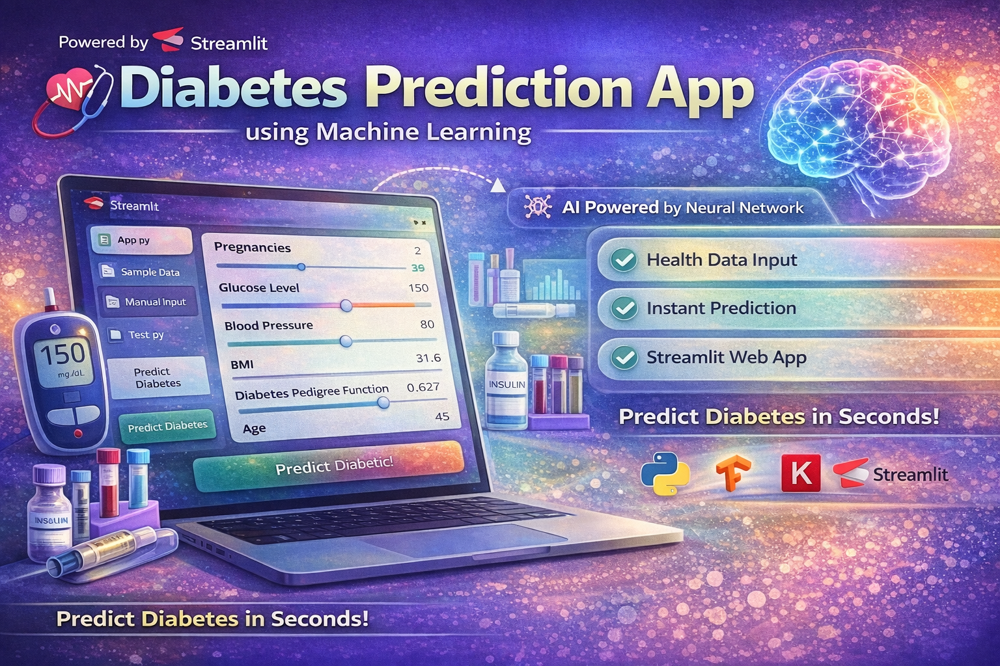

<p align="center">
  
</p>

---

# 🩺 Diabetes Prediction App using Machine Learning

A simple and powerful **Machine Learning web application** built with **Streamlit** that predicts whether a person is diabetic or not based on medical input features.

---

## 🚀 Project Overview

This project uses a **Neural Network (Deep Learning Model)** trained on the **Pima Indians Diabetes Dataset** to predict diabetes.

Users can input health-related parameters through a clean web interface and instantly get predictions.

---

## 🎯 Features

* 🧠 Deep Learning Model (Keras / TensorFlow)
* 🌐 Interactive Web App using Streamlit
* ⚡ Real-time Prediction
* 📊 User-friendly input fields
* ✅ Instant result display (Diabetic / Not Diabetic)

---

## 📂 Project Structure

```
DIABETES_PREDICTION/
│
├── app.py                     # Streamlit App
├── train.py                  # Model Training Script
├── test.py                   # Model Testing Script
├── diabetes_model.h5         # Trained Model
├── pima-indians-diabetes.csv # Dataset
├── requirements.txt          # Dependencies
└── README.md                 # Project Documentation
```

---

## 🧠 Machine Learning Model

* Algorithm: **Artificial Neural Network (ANN)**
* Framework: **Keras + TensorFlow**
* Activation Functions: ReLU, Sigmoid
* Loss Function: Binary Crossentropy
* Optimizer: Adam

---

## 📊 Input Features

1. Pregnancies
2. Glucose Level
3. Blood Pressure
4. Skin Thickness
5. Insulin
6. BMI
7. Diabetes Pedigree Function
8. Age

---

## ▶️ How to Run the Project

### 1️⃣ Clone the Repository

```
git clone https://github.com/selvan-01/diabetes-prediction.git
cd diabetes-prediction
```

---

### 2️⃣ Install Dependencies

```
pip install -r requirements.txt
```

---

### 3️⃣ Run the App

```
streamlit run app.py
```

---

### 4️⃣ Open in Browser

```
http://localhost:8501
```

---

## 🧪 Sample Input

```
Pregnancies: 2
Glucose: 120
Blood Pressure: 70
Skin Thickness: 20
Insulin: 85
BMI: 28.5
Pedigree: 0.5
Age: 30
```

---

## 🎯 Output

* ✅ Not Diabetic
* ⚠️ Diabetic

---

## 📌 Future Improvements

* 🎨 Advanced UI/UX Design
* 📊 Show prediction probability
* ☁️ Deploy to cloud (Streamlit Cloud / Render)
* 📱 Mobile responsive UI

---
## 🔗 Links

- 💼 [LinkedIn](https://www.linkedin.com/in/senthamil45)
- 🌍 [Portfolio](https://senthamill.vercel.app/)
- 💻 [GitHub](https://github.com/selvan-01/diabetes-prediction.git)


---

## ⭐ Support

If you like this project, give it a ⭐ on GitHub!

---

## 🏁 Conclusion

This project demonstrates how Machine Learning can be used in real-world healthcare applications to assist in early diagnosis and decision-making.

---
